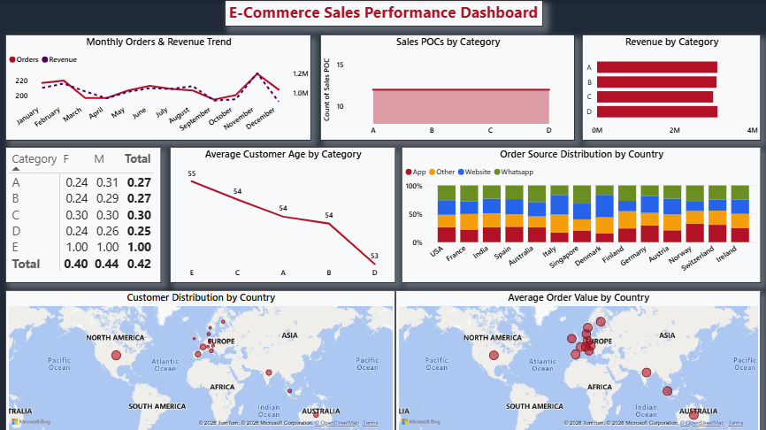
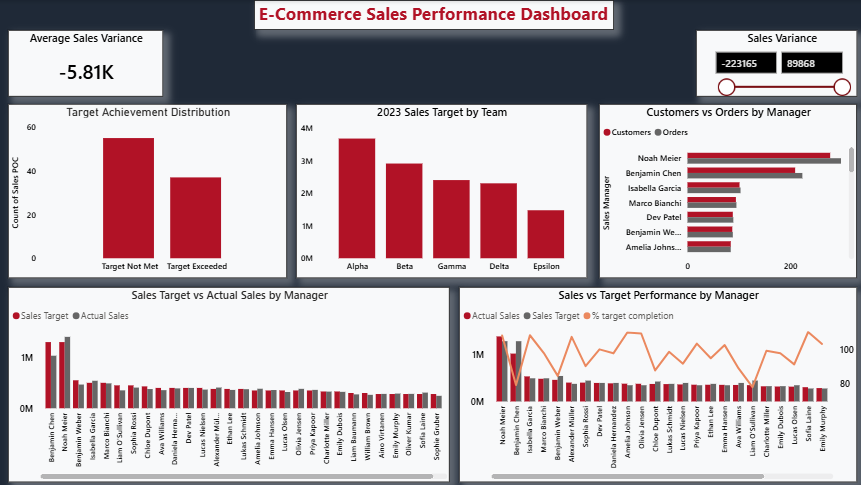
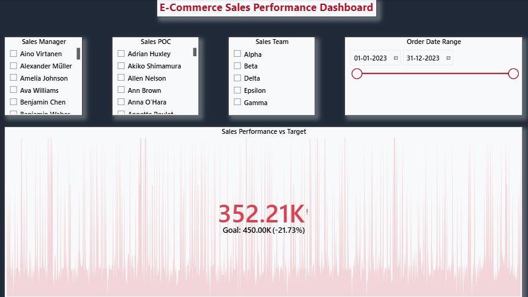

# 📊 E-Commerce Sales Performance Dashboard | Power BI

## Project Overview

This project analyzes E-Commerce sales performance across sales teams, managers, customers, products, and countries using Power BI.

The dashboard helps stakeholders monitor sales performance against targets, identify underperforming areas, evaluate customer distribution, and uncover revenue trends for better business decision-making.

---

## Business Problem

The organization needed a centralized reporting solution to:

- Track sales performance against targets
- Monitor team and manager effectiveness
- Analyze customer distribution across countries
- Identify revenue-driving categories
- Measure target achievement rates
- Understand sales variance and performance gaps

---

## Tools & Technologies

- Power BI
- Power Query
- DAX
- Excel
- Data Modeling
- Data Visualization

---

## Data Cleaning & Preparation

The following data preparation steps were performed:

- Removed duplicate records
- Handled missing and inconsistent values
- Standardized data formats
- Validated category and team information
- Created calculated columns and measures using DAX
- Built relationships between tables
- Optimized data model for reporting

---

## Dashboard Pages

### 1️⃣ Customer & Revenue Insights

Key Visuals:

- Monthly Orders & Revenue Trend
- Revenue by Category
- Sales POCs by Category
- Customer Distribution by Country
- Average Order Value by Country
- Order Source Analysis

---

### 2️⃣ Sales Team Performance Analysis

Key Visuals:

- Team-wise Sales Targets
- Target Achievement Distribution
- Customers vs Orders by Manager
- Sales Variance Analysis
- Actual vs Target Sales Comparison
- Manager Performance Tracking

---

### 3️⃣ Sales Performance Overview

Key Visuals:

- Interactive Filters
- Sales Manager Analysis
- Sales Team Analysis
- Date Range Filtering
- Overall Target Performance Monitoring

---

## Key Business Insights

### Sales Performance

- Average sales variance remained below target, indicating performance gaps.
- Several managers consistently missed assigned sales targets.
- Sales achievement varied significantly across teams.

### Revenue Trends

- Revenue showed seasonal fluctuations throughout the year.
- Certain months generated noticeably higher revenue and order volumes.

### Customer Analysis

- Customer concentration was higher in selected geographic regions.
- Order values varied significantly across countries.

### Category Performance

- Revenue contribution differed across product categories.
- Some categories generated higher sales despite lower customer volumes.

### Sales Channels

- Website, App, WhatsApp, and other channels contributed differently across countries.
- Customer acquisition behavior varied by region.

---

## Business Recommendations

### Improve Target Planning

- Review target allocation methodology.
- Align targets with historical performance and regional potential.

### Focus on Underperforming Teams

- Provide additional coaching and support.
- Investigate operational bottlenecks impacting performance.

### Strengthen High-Performing Regions

- Increase marketing investments in top-performing markets.
- Replicate successful sales strategies across regions.

### Optimize Sales Channels

- Focus on channels with higher conversion rates.
- Improve engagement in underutilized channels.

### Category Growth Strategy

- Expand high-performing categories.
- Develop targeted campaigns for low-performing categories.

---

## Skills Demonstrated

- Business Intelligence
- Data Cleaning
- Data Transformation
- DAX Measures
- KPI Development
- Dashboard Design
- Data Visualization
- Sales Analytics
- Business Analysis
- Performance Reporting

---

## Repository Contents

| File | Description |
|--------|-------------|
| Ecommerce_Sales_Dashboard.pbix | Power BI Dashboard File |
| Ecommerce_Sales_Dataset.xlsx | Source Dataset |
| Customer_and_revenue_insights.png | Dashboard Screenshot |
| Sales_team.png | Dashboard Screenshot |
| Sales_performance_overview.png | Dashboard Screenshot |

---

## Author

**Rahul Chhabra**
